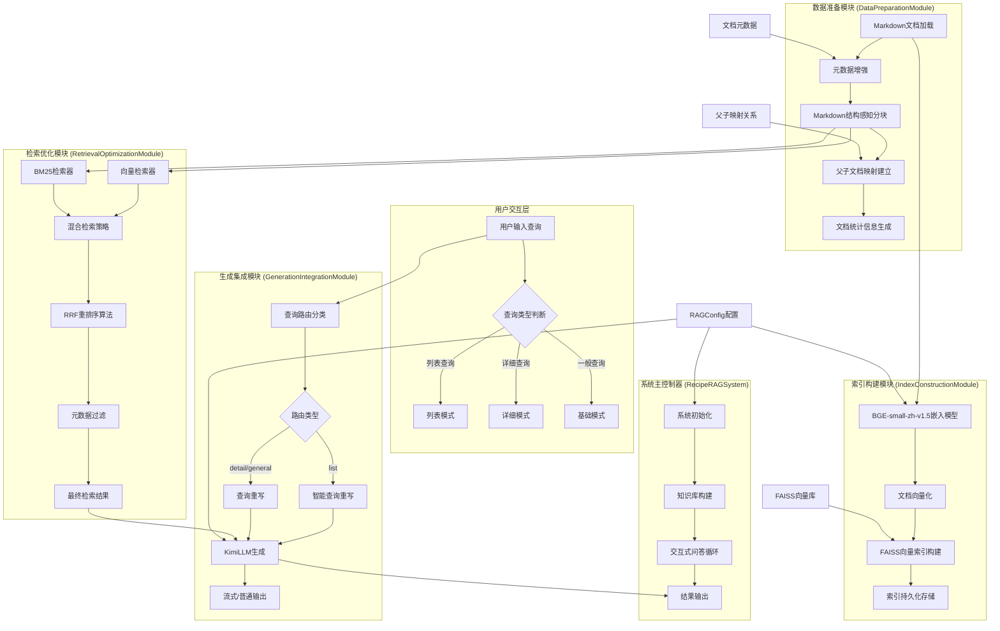

<div align="center">
<h1>🍳食谱问答系统 CookRAG </h1>
<p>


</p>
</div>

## 🎯 项目目标与定位

本项目旨在在实践中巩固学习和理解RAG（Retrieval-Augmented Generation，检索增强生成）技术。在接触如 [Dify](https://dify.ai/)、[RAGFlow](https://github.com/infiniflow/ragflow) 这类高度封装的RAG框架之前，通过本项目的源码和实践，可以：

*   **熟悉RAG核心组件**：亲身体验文本加载、切分、向量化、向量存储与检索（本项目使用FAISS）、大模型集成等关键环节。
*   **理解RAG基本流程**：从底层脚本层面观察数据如何在RAG系统中流转和处理。
*   **进行初步优化与测试**：尝试调整参数、替换模型、优化提示词等，直观感受不同策略对结果的影响。

掌握这些基础后，能更有的放矢地使用高级RAG框架的API进行针对性调优或定制开发。

## 🔧 系统架构



## 🚀 使用方法

### 环境准备

1.  **创建并激活虚拟环境**:
    ```bash
    conda create -n cookRAG python=3.12.7
    conda activate cookRAG
    ```
2.  **安装依赖项**:
    ```bash
    cd normRAG
    pip install -r requirements.txt
    ```
3.  **配置Kimi API密钥**:
    在电脑“设置”中

### 启动服务

```bash
python main.py
```
