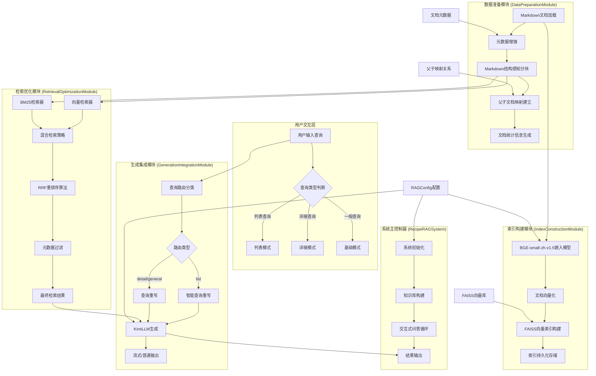

<div align="center">
<h1>🍳食谱问答系统 CookRAG </h1>
<p>


</p>

**一个帮助RAG入门者理解核心组件和流程的本地化智能问答项目**
</div>

## 🎯 项目目标与定位

本项目旨在为希望学习和理解RAG（Retrieval-Augmented Generation，检索增强生成）技术的初学者提供一个清晰、可动手实践的起点。在接触如 [Dify](https://dify.ai/)、[RAGFlow](https://github.com/infiniflow/ragflow) 这类高度封装的RAG框架之前，通过本项目的源码和实践，你可以：

*   **熟悉RAG核心组件**：亲身体验文本加载、切分、向量化、向量存储与检索（本项目使用FAISS）、大模型集成等关键环节。
*   **理解RAG基本流程**：从底层脚本层面观察数据如何在RAG系统中流转和处理。
*   **进行初步优化与测试**：尝试调整参数、替换模型、优化提示词等，直观感受不同策略对结果的影响。

掌握这些基础后，能更有的放矢地使用高级RAG框架的API进行针对性调优或定制开发。

## 🌟 核心功能

*   📁 **PDF文档处理**：上传并处理多个PDF文档，自动分割和向量化。
*   🧠 **智能问答**：基于本地文档的精准问答能力。
*   🔍 **混合检索**：结合FAISS进行语义检索和BM25进行关键词检索，提高检索召回率和准确性。
*   🔄 **结果重排序**：支持交叉编码器（CrossEncoder）和LLM对检索结果进行重排序，优化相关性。
*   🌐 **联网搜索增强 (可选)**：通过SerpAPI获取实时网络信息，增强回答的时效性（需配置API密钥）。
*   🗣️ **多LLM支持**：可选择使用本地Ollama大模型（如DeepSeek-R1系列）或云端SiliconFlow API进行推理。
*   迭代式深度检索（递归检索）：通过LLM分析当前结果，自动生成后续查询，深入探索问题。
*   📄 **来源标注与矛盾检测 (初步)**：尝试在回答中提供信息来源，并识别潜在信息矛盾。
*   🖥️ **用户友好界面**：基于Gradio构建交互式Web界面，方便文档上传、提问和结果查看。
*   📊 **分块可视化**：在UI上展示文档分块情况，帮助理解数据处理过程。
*   🔒 **本地化优先**：核心数据处理和LLM推理可完全在本地进行，保障数据隐私。

## 🔧 系统架构



## 🚀 使用方法

### 环境准备

1.  **创建并激活虚拟环境**:
    ```bash
    conda create -n cookRAG python=3.12.7
    conda activate cookRAG
    ```
2.  **安装依赖项**:
    ```bash
    cd normRAG
    pip install -r requirements.txt
    ```
3.  **配置Kimi API密钥**:
    在电脑“设置”中

### 启动服务

```bash
python main.py
```

一个成功的运行片段可能如下所示（已省略部分重复内容和时间戳）：


**日志关键点解读：**

*   **FAISS与BM25索引构建**：显示了文档处理后向量索引和关键词索引的成功创建。
*   **递归检索迭代**：清晰展示了系统如何通过多轮查询（此处配置为3轮）来逐步深化对用户问题的理解和信息召回。
*   **模型加载与使用**：包括SentenceTransformer（用于向量化和交叉编码器）、Jieba（用于BM25分词）的加载，以及与LLM（此处为SiliconFlow API）的交互。
*   **中间过程**：如网络搜索结果的获取、交叉编码器重排序的时间消耗等，都为性能分析和流程理解提供了线索。
*   **LLM生成新查询**：当LLM（如SiliconFlow或Ollama）分析后认为需要更深入的信息时，它会主动生成更具体的新查询点，驱动下一轮的检索，这是高级RAG能力的体现。

建议通过观察这些日志，直观地感受到RAG系统中各个组件是如何协同工作的。

## 📦 核心依赖

*   `gradio`: 构建交互式Web界面。
*   `sentence-transformers`: 用于文本向量化和交叉编码器重排序。
*   `faiss-cpu`: 高效的向量相似性搜索引擎。
*   `langchain-text-splitters`: 仅用于文本分割功能，更加轻量。
*   `pdfminer.six`: 从PDF文件中提取文本。
*   `rank_bm25`: 实现BM25关键词检计算法。
*   `jieba`: 中文分词，用于BM25索引和可能的文本预处理。
*   `python-dotenv`: 管理环境变量 (如API密钥)。
*   `requests`, `urllib3`: 进行HTTP请求 (如调用SerpAPI, SiliconFlow API, Ollama API)。
*   `numpy`: FAISS等库的基础依赖，进行数值计算。
*   (可选API服务) `fastapi`, `uvicorn`, `python-multipart`: 如果您想独立运行`api_router.py`提供API服务。

## 💡 进阶与扩展方向

本项目作为一个入门级的RAG实现，为后续的迭代和功能扩展提供了良好的基础。以下是一些可以考虑的进阶方向：

1.  **更精细化的文本切分策略**：
    *   **解释**：当前的`RecursiveCharacterTextSplitter`是通用策略。可以研究并实现基于语义的切分（如使用模型判断句子边界或主题连贯性）、或针对特定文档类型的结构化切分（如解析Markdown标题、表格等）。
    *   **难度**：中等。
2.  **高级FAISS索引与管理**：
    *   **解释**：目前使用的是基础的`IndexFlatL2`。可以尝试更高级的FAISS索引类型，如`IndexIVFPQ`，以优化大规模数据下的检索速度和内存占用。同时，研究如何更优雅地支持对FAISS中向量的删除和更新（例如，使用`IndexIDMap`）。
    *   **难度**：中等至困难。
3.  **多元数据源接入**：
    *   **解释**：目前主要处理PDF和可选的网络搜索。可以扩展支持导入其他格式的本地文档（如`.txt`, `.md`, `.docx`），或者接入外部API（如Notion、Confluence等知识库）。
    *   **难度**：中等。
4.  **查询改写与意图识别**：
    *   **解释**：在进行检索前，使用LLM对用户的原始查询进行改写（如纠错、同义词扩展、澄清模糊表述）或识别用户真实意图，可以提高检索的精准度。
    *   **难度**：中等。
5.  **上下文管理与压缩**：
    *   **解释**：当检索到的相关片段过多，超出LLM的上下文窗口限制时，需要有效的上下文压缩策略（如筛选最重要片段、总结次要片段）来保证信息质量。
    *   **难度**：中等。
6.  **更复杂的重排序模型/策略**：
    *   **解释**：除了当前的交叉编码器和基于LLM打分，可以尝试集成更先进的重排序模型，或实现多阶段重排序策略。
    *   **难度**：中等至困难。
7.  **答案生成效果评估与追溯**：
    *   **解释**：引入简单的评估机制（如用户反馈、答案与来源的相似度计算）和更清晰的答案来源追溯展示，帮助分析和改进系统表现。
    *   **难度**：中等。

欢迎大家基于此项目进行探索和贡献！

## 🚀 进一步学习与交流

本项目旨在提供一个RAG入门的练手平台。如果你对企业级RAG的深入实践、复杂场景应用、性能优化以及最新技术进展感兴趣，欢迎加入我的知识星球 **"企业RAG从入门到落地"** 进行更深入的学习和交流。
